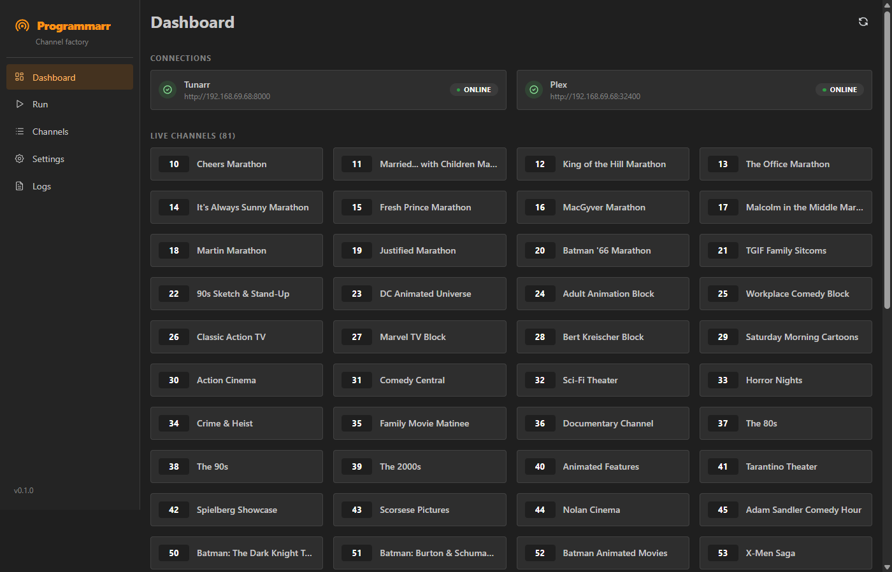
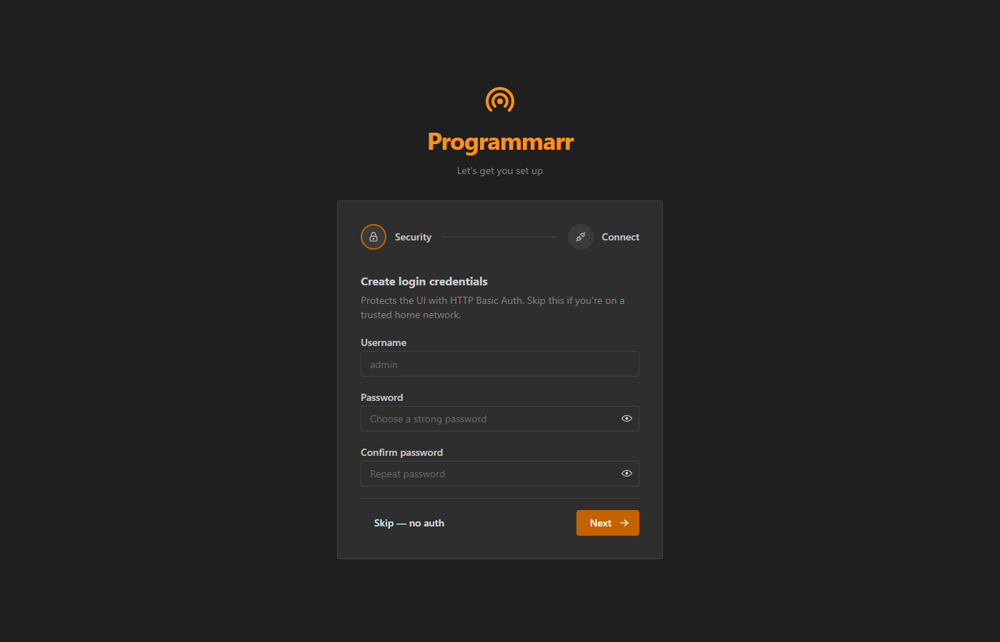
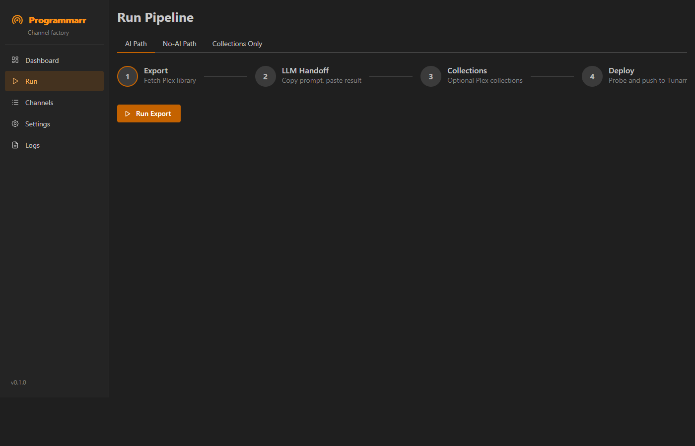
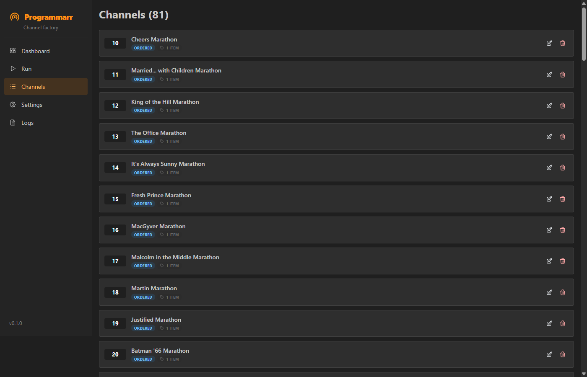
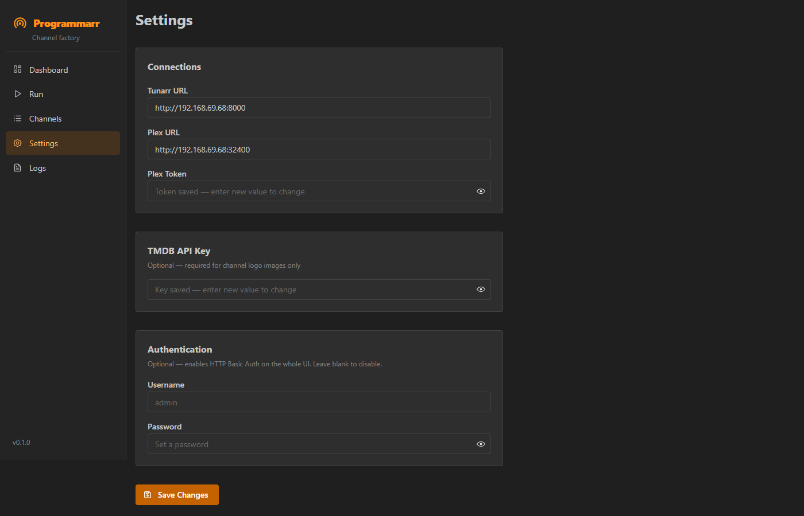

# Programmarr

<div align="center">

**Turn your Plex library into themed virtual TV channels in [Tunarr](https://github.com/chrisbenincasa/tunarr)**

[](LICENSE)
[](https://python.org)
[](https://hub.docker.com)
[](https://claude.ai/claude-code)

</div>

---

Programmarr is a self-hosted web app that exports your Plex library, lets you feed it to an LLM, and deploys the results as themed virtual TV channels in Tunarr — with a web UI that feels like Sonarr or Radarr.

**Requires:** [Tunarr](https://github.com/chrisbenincasa/tunarr) + Plex

---

## Quick Start

### 1. Pull and start

```bash
docker compose up -d
```

That's it — the image is pre-built on [GHCR](https://github.com/AlpineArchitecture/programmarr/pkgs/container/programmarr) and pulls automatically. No local build step needed.

### 2. Open the UI

```
http://<your-server-ip>:7979
```

First run shows an onboarding wizard — create a login, enter your Tunarr and Plex URLs, done.

### Updates

Add [Watchtower](https://containrrr.dev/watchtower/) to your compose file and updates happen automatically — no SSH, no manual pulls, no Portainer. Watchtower checks every 5 minutes and restarts the container if a new image is available:

```yaml
services:
  programmarr:
    image: ghcr.io/alpinearchitecture/programmarr:latest
    container_name: programmarr
    restart: unless-stopped
    ports:
      - "7979:7979"
    volumes:
      - ./data:/data

  watchtower:
    image: containrrr/watchtower
    container_name: watchtower
    environment:
      - DOCKER_API_VERSION=1.44
    volumes:
      - /var/run/docker.sock:/var/run/docker.sock
    command: --interval 300 programmarr
    restart: unless-stopped
```

> **Note:** The `DOCKER_API_VERSION=1.44` env var is required on newer Docker engines (TrueNAS, Docker Desktop 4.x+). Without it, Watchtower crash-loops with "client version 1.25 is too old".

Or update manually any time:

```bash
docker compose pull && docker compose up -d
```

### TrueNAS

Paste this as a complete compose file in Apps → Custom App:

```yaml
services:
  programmarr:
    image: ghcr.io/alpinearchitecture/programmarr:latest
    container_name: programmarr
    restart: unless-stopped
    ports:
      - "7979:7979"
    volumes:
      - /mnt/YourPool/AppData/programmarr/data:/data

  watchtower:
    image: containrrr/watchtower
    container_name: watchtower
    environment:
      - DOCKER_API_VERSION=1.44
    volumes:
      - /var/run/docker.sock:/var/run/docker.sock
    command: --interval 300 programmarr
    restart: unless-stopped
```

Replace `/mnt/YourPool/AppData/programmarr/data` with a real path on your pool.

---

## Screenshots

<div align="center">
  
  <p><em>Dashboard — live view of all 81 channels with Tunarr and Plex connection status</em></p>
</div>

<br />

<table>
  <tr>
    <td width="50%" valign="top">
      
      <p align="center"><em>First-run setup wizard — credentials and connections in two steps</em></p>
    </td>
    <td width="50%" valign="top">
      
      <p align="center"><em>Run Pipeline — choose AI, No-AI, or Collections path; live terminal output streams to the browser</em></p>
    </td>
  </tr>
  <tr>
    <td width="50%" valign="top">
      
      <p align="center"><em>Channel editor — view, edit, and delete channels directly in the browser</em></p>
    </td>
    <td width="50%" valign="top">
      
      <p align="center"><em>Settings — all connection config and optional auth in one place</em></p>
    </td>
  </tr>
</table>

---

## What it does

| Path | How it works |
|------|-------------|
| **AI Path** | Export your library → copy prompt + CSV into any LLM → paste the result back → deploy |
| **No-AI Path** | Auto-generates decade, genre, and TV marathon channels from your metadata |
| **Collections** | Turns each Plex collection (Kometa, Trakt, Letterboxd) into its own channel |

All three paths end with a probe (dry run) → deploy to Tunarr. The app streams live output to the browser so you can watch it work.

### Also included

- **Channel logo fetching** — pulls TMDB clearlogos for single-show/movie channels
- **Plex DVR sync** — maps new channels into the Plex Live TV guide automatically
- **Channel editor** — edit names, numbers, shuffle mode, and content lists in the browser
- **Optional basic auth** — set a username/password if you expose the UI outside your LAN

---

## Configuration

Everything is set through the UI. Config is stored in `./data/config.json` (bind-mounted, never baked into the image).

| Field | Required | Notes |
|-------|----------|-------|
| Tunarr URL | Yes | e.g. `http://192.168.1.10:8000` |
| Plex URL | Yes | e.g. `http://192.168.1.10:32400` |
| Plex Token | Yes | [How to find yours](https://www.plexopedia.com/plex-media-server/general/plex-token/) |
| TMDB API Key | No | Free at [themoviedb.org](https://www.themoviedb.org/settings/api) — only needed for channel logos |

---

## CLI (advanced)

If you prefer the terminal, all the same functionality is available via `programmarr.py`:

```bash
python programmarr.py
```

The Python scripts have zero dependencies beyond the standard library and work standalone without Docker.

---

## Acknowledgments

Built with [Claude Code](https://claude.ai/claude-code). Made possible by [Tunarr](https://github.com/chrisbenincasa/tunarr), [Plex](https://www.plex.tv/), [TMDB](https://www.themoviedb.org/), and [Kometa](https://kometa.wiki/).

[⭐ Star on GitHub](https://github.com/AlpineArchitecture/programmarr) · [🐛 Report a Bug](https://github.com/AlpineArchitecture/programmarr/issues)
